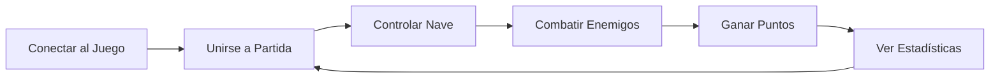

# MVP Orbits - Juego Espacial Multijugador

## 🎯 Definición del MVP

### **Objetivo Principal**
Crear un juego espacial multijugador funcional y divertido que permita a los jugadores combatir en tiempo real en un entorno espacial, con un core gameplay loop sólido y adictivo.

---

## 🎮 Core Gameplay Loop (MVP)

### **Loop Principal**
1. **Conectar** → Autenticación simple
2. **Unirse** → Matchmaking básico
3. **Jugar** → Mover nave y disparar
4. **Combatir** → PvP en tiempo real
5. **Progresar** → Puntos y estadísticas
6. **Repetir** → Nueva partida

---

## ⭐ Funcionalidades del MVP

### **🔐 Sistema de Autenticación (Crítico)**
- **Registro**: Email + Password + Username
- **Login**: Autenticación JWT
- **Sesión**: Mantener login durante el juego
- **Perfil**: Estadísticas básicas del jugador

### **🎮 Motor de Juego Básico (Crítico)**
- **Nave Espacial**: Sprite animado controlable
- **Movimiento**: WASD o flechas, suave y responsive
- **Límites**: Área de juego definida
- **Física**: Momentum y rotación básica

### **⚔️ Sistema de Combate (Alto)**
- **Disparos**: Proyectiles simples
- **Vida**: HP system básico
- **Daño**: Colisiones causan daño
- **Destrucción**: Explosión al morir
- **PvE Básico**: NPCs enemigos con IA simple

### **🌐 Multijugador en Tiempo Real (Crítico)**
- **Conexión**: WebSocket con Socket.io
- **Sincronización**: Posición de jugadores en tiempo real
- **Salas**: 2-8 jugadores por partida
- **Latencia**: < 100ms para jugabilidad fluida

### **📊 Sistema de Puntuación (Medio)**
- **Kills**: Puntos por destruir naves enemigas
- **Sobrevivencia**: Bonus por tiempo vivo
- **Ranking**: Tabla de puntuaciones de partida
- **Estadísticas**: Wins/Losses básicas

---

## 🚀 Quick Wins Identificados

### **Quick Win 1: Pantalla de Juego Básica** ⚡
**Tiempo**: 1-2 días  
**Valor**: Alto impacto visual inmediato

- ✅ Escenario Phaser.js funcional
- ✅ Fondo espacial con estrellas
- ✅ Nave básica renderizada
- ✅ Controles de movimiento
- ✅ Límites de pantalla

**Demo**: "Nave que se mueve en pantalla"

### **Quick Win 2: Autenticación Funcional** ⚡
**Tiempo**: 2-3 días  
**Valor**: Base para multijugador

- ✅ API de registro/login
- ✅ Pantalla de login React
- ✅ JWT tokens funcionando
- ✅ Protección de rutas
- ✅ Perfil básico de usuario

**Demo**: "Usuario puede loguearse y acceder al juego"

### **Quick Win 3: Conexión Multijugador** ⚡
**Tiempo**: 3-4 días  
**Valor**: Proof of concept del multijugador

- ✅ WebSocket conectando
- ✅ Múltiples jugadores visibles
- ✅ Movimiento sincronizado
- ✅ Entrada/salida de jugadores
- ✅ Contador de jugadores online

**Demo**: "2+ jugadores se ven moverse en tiempo real"

### **Quick Win 4: Combate PvP + PvE Básico** ⚡
**Tiempo**: 5-6 días  
**Valor**: Gameplay core funcional con contenido PvE

- ✅ Disparos con clic/espacio
- ✅ Proyectiles sincronizados
- ✅ Sistema de vida (HP)
- ✅ Destrucción de naves
- ✅ Respawn automático
- ✅ NPCs enemigos básicos
- ✅ IA simple de NPCs

**Demo**: "Jugadores pueden combatir entre sí y contra NPCs"

### **Quick Win 5: Sistema PvE Expandido** ⚡
**Tiempo**: 3-4 días  
**Valor**: Contenido para modo individual

- ✅ Spawn automático de NPCs
- ✅ Diferentes tipos de enemigos
- ✅ Sistema de recompensas por NPCs
- ✅ Balanceo PvE vs PvP
- ✅ Oleadas de enemigos

**Demo**: "Modo PvE funcional con oleadas de enemigos"

---

## 📋 Roadmap de Desarrollo

### **Sprint 1: Fundación (2 semanas)**
**Goal**: Tener demo jugable para 1 jugador

- **Semana 1**:
  - ✅ Quick Win 1: Pantalla de juego básica
  - ✅ Quick Win 2: Autenticación funcional
  
- **Semana 2**:
  - ✅ Integración auth + juego
  - ✅ Refinamiento de controles
  - ✅ UI básica (vida, puntos)

**Entregable**: Demo con nave controlable + login

### **Sprint 2: Multijugador (2 semanas)**
**Goal**: Multijugador funcional sin combate

- **Semana 3**:
  - ✅ Quick Win 3: Conexión multijugador
  - ✅ Salas de juego básicas
  
- **Semana 4**:
  - ✅ Optimización de latencia
  - ✅ Manejo de desconexiones
  - ✅ UI de lobby

**Entregable**: 2+ jugadores moviéndose juntos

### **Sprint 3: Combate PvP + PvE (2 semanas)**
**Goal**: MVP completo con PvE y PvP funcional

- **Semana 5**:
  - ✅ Quick Win 4: Combate PvP + PvE básico
  - ✅ Sistema de puntuación
  
- **Semana 6**:
  - ✅ Quick Win 5: Sistema PvE expandido
  - ✅ Balance PvE vs PvP
  - ✅ Polish visual y testing

**Entregable**: MVP completo con PvE y PvP funcional

### **Sprint 4: Refinamiento PvE (1 semana)**
**Goal**: Pulir experiencia PvE y balance general

- **Semana 7**:
  - ✅ Diferentes tipos de NPCs
  - ✅ Sistema de oleadas mejorado
  - ✅ Recompensas balanceadas
  - ✅ Testing intensivo y fixes

**Entregable**: Juego completo con PvE robusto

---

## 🎯 Criterios de Éxito del MVP

### **Métricas Técnicas**
- ✅ Latencia < 100ms
- ✅ 8+ jugadores simultáneos sin lag
- ✅ 0 crashes en 30min de juego
- ✅ Carga inicial < 5 segundos

### **Métricas de Gameplay**
- ✅ Partida promedio > 5 minutos
- ✅ Tiempo de matchmaking < 30 segundos
- ✅ Tasa de reenganche > 60%
- ✅ NPS > 7/10 en testing

### **Funcionalidades Mínimas**
- ✅ Login/registro funcional
- ✅ Conexión multijugador estable
- ✅ Combate PvP responsivo
- ✅ Sistema PvE con NPCs funcional
- ✅ Puntuación en tiempo real
- ✅ Salas de 2-8 jugadores
- ✅ Modo individual vs NPCs

---

## 🚧 Out of Scope (Post-MVP)

### **No incluir en MVP inicial**:
- ❌ Progresión de niveles/experiencia
- ❌ Sistema de clases/builds de naves
- ❌ Mapas múltiples
- ❌ Power-ups o items
- ❌ Chat de texto/voz
- ❌ Replay system
- ❌ Espectador mode
- ❌ Rankings globales persistentes
- ❌ Sistema de clanes/equipos
- ❌ Microtransacciones

### **Agregar después del MVP**:
1. **v1.1**: Sistema de progresión
2. **v1.2**: Múltiples mapas
3. **v1.3**: Power-ups y items
4. **v1.4**: Sistema social (clanes)
5. **v2.0**: Modo campaña/PvE

---

## 🔄 Loop de Validación

### **Testing Semanal**
- **Playtesting**: 3-5 personas por semana
- **Feedback**: ¿Es divertido? ¿Qué falta?
- **Métricas**: Tiempo de juego, retención
- **Iteración**: Ajustes basados en feedback

### **Hitos de Validación**
1. **Semana 2**: ¿Los controles se sienten bien?
2. **Semana 4**: ¿El multijugador es estable?
3. **Semana 6**: ¿El juego es divertido y adictivo?

---

**🎮 Objetivo Final**: Un juego multijugador divertido que la gente quiera jugar más de una vez, con base sólida para evolucionar hacia un MMORPG espacial completo.